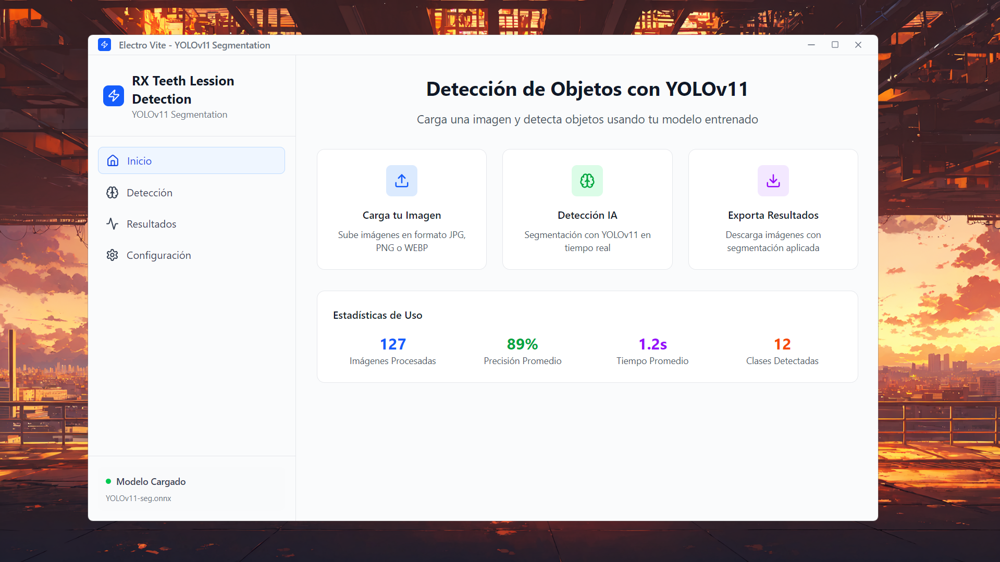
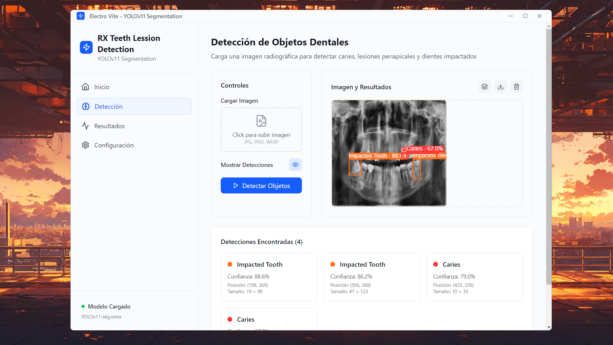

# React + TypeScript + Vite
# Rx-TeethLession 🦷

A dental X-ray lesion detection application using ONNX models and web technologies.

## Features & Tech Stack

- **React + TypeScript** - Simple UI with drag & drop file support
- **Electron** - Desktop application
- **ONNX Runtime Web** - YOLOv11 model inference with WebAssembly
- **Vite** - Build tool

## 📸 Screenshots

### Overview Interface

*Application overview page (currently in development)*

### Detection Interface

*Main detection interface - drag and drop or select PNG/JPG files to detect teeth lesions*

## 🛠️ Installation & Setup

### Prerequisites
- Node.js (v16 or higher)
- npm or pnpm

### Quick Start
```bash
# Install dependencies
npm install

# Start development server
npm run dev
```

## 🧠 Model Configuration

### Using the Pre-trained Model
The application includes a pre-trained ONNX model located at `public/model/best.onnx`.

### WebAssembly Setup
To enable WebAssembly acceleration, you need to configure the required WASM files:

1. **Copy WASM files** from your `node_modules` to the public directory:
   ```
   node_modules/onnxruntime-web/dist/ → public/wasm/
   ```

2. **Required files**:
   - `ort-wasm-simd-threaded.jsep.wasm`
   - `ort-wasm-simd-threaded.wasm`

## 📊 Model Training

This project uses a YOLOv11 model trained with:
- **Base Model**: `yolov11l.pt`
- **Dataset**: [Roboflow arshs-workspace-radio/vzrad-6](https://universe.roboflow.com/arshs-workspace-radio/vzrad2)

## 🙏 Acknowledgments

Thanks to [Roboflow arshs-workspace-radio dataset](https://universe.roboflow.com/arshs-workspace-radio/vzrad2) for the dental X-ray images and labels.

---
